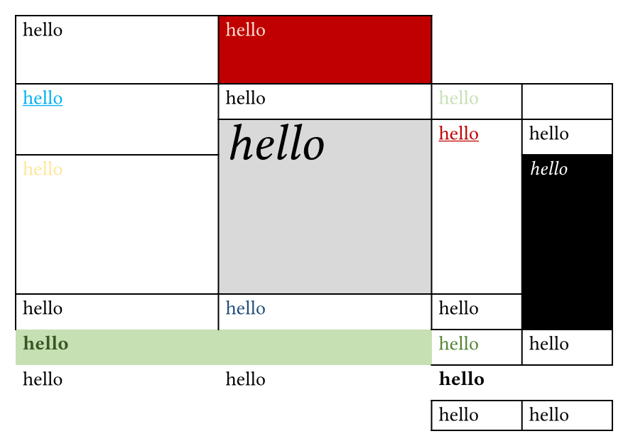

# ReXLlenT

ReXLlenT is a typst package that helps you convert Excel **xlsx** tables to typst tables, powered by wasm. (Formerly eXMLlent.)

## Quick Start

Start by importing the package:

```typ
#import "@preview/rexllent:0.2.0": xlsx-parser
```

Then you can use `xlsx-parser` function to convert your xlsx Excel table to typst table. Here is an example:

```typ
#xlsx-parser(read("test.xlsx", encoding: none))
```

By passing `sheet-index` parameter, you can specify the sheet index to parse. The default value is 0.

```typ
#xlsx-parser(read("test.xlsx", encoding: none), sheet-index: 1)
```

Extra arguments passed to `xlsx-parser` function will be passed to `table`. Feel free to customize the output table.

Toggling the parameters `parse-table-style`, `parse-alignment`, and `parse-font-style` to `false` will disable parsing of table styles, alignment, and font styles respectively.

| Sheet in Excel | Table in Typst | Table in Typst (without table styles) | Table in Typst (without alignment) | Table in Typst (without font styles) |
| --- | --- | --- | --- | --- |
|  |  |  |  |  |

Have fun!

## Credits

- [lublak/typst-spreet-package](https://github.com/lublak/typst-spreet-package)
- [MathNya/umya-spreadsheet](https://github.com/MathNya/umya-spreadsheet)

## License

This package is licensed under the MIT License.
